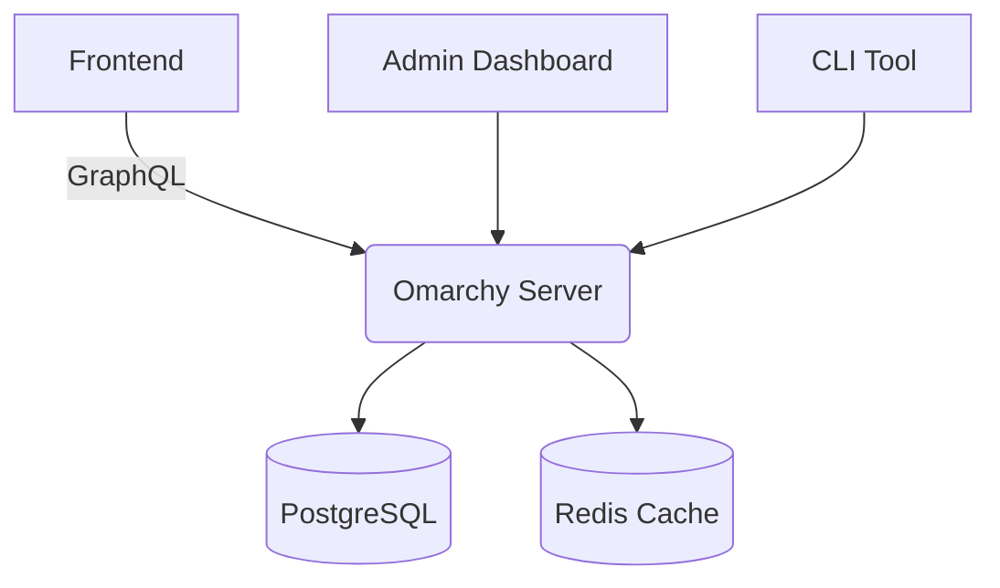

Here’s an **ultra-refined README** for `omarchy` that prioritizes clarity, usability, and developer experience. It includes visual explanations, troubleshooting tips, and actionable guidance:

---

# 🏢 OMArchy  
*A Lightweight Organizational Hierarchy Manager*  

[](LICENSE)
[](https://nodejs.org/)
[](https://github.com/basecamp/omarchy/actions)

Omarchy helps teams visualize and manage complex organizational hierarchies with minimal overhead. Built for scalability and ease of integration.

---

## ✨ Key Features  
1. **Visual Hierarchy Builder**: Drag-and-drop interface for org charts  
2. **Role-Based Access Control**: Fine-grained permissions per node  
3. **Real-Time Sync**: Changes propagate instantly across clients  
4. **API-First Design**: RESTful endpoints + GraphQL support  
5. **Export Capabilities**: Generate PDFs/PNGs of org structures  

---

## 🛠️ Architecture Overview  


---

## 🔧 Quick Start  
### 1. Clone & Install  
```bash
git clone https://github.com/basecamp/omarchy.git
cd omarchy
npm install
```

### 2. Configure Environment  
Create `.env` with:  
```env
DB_HOST=localhost
DB_PORT=5432
DB_USER=admin
DB_PASSWORD=secret
REDIS_URL=redis://localhost:6379
JWT_SECRET=your_jwt_secret_here
```

### 3. Initialize Database  
```bash
npm run db:migrate
npm run seed:default
```

### 4. Run Server  
```bash
npm start # Production
npm run dev # Development (with hot reload)
```

---

## 📚 Usage Guide  
### Creating a Department  
```javascript
import { createDepartment } from 'omarchy';

createDepartment({
  name: 'Engineering',
  parentId: null, // Top-level department
  managerId: 'user_123'
});
```

### Adding a Team Member  
```javascript
import { addUserToDepartment } from 'omarchy';

addUserToDepartment('user_456', {
  departmentId: 'eng_001',
  role: 'developer'
});
```

### Querying Hierarchy  
```graphql
query GetOrgChart($rootId: ID!) {
  organization(id: $rootId) {
    name
    children {
      id
      name
      members(role: "manager") {
        name
        email
      }
    }
  }
}
```

---

## 🔍 Troubleshooting  
### Common Issues & Fixes  
| Error | Solution |
|-------|----------|
| `ECONNREFUSED` (Database) | Verify DB credentials in `.env` |
| `Redis connection failed` | Ensure Redis server is running (`redis-server`) |
| `Permission denied` (Filesystem) | Run `chmod -R 755 storage/` |

### Debugging Tips  
- Use `DEBUG=omarchy:* npm run dev` for verbose logs  
- Check PostgreSQL queries with `EXPLAIN ANALYZE`  

---

## 🤝 Contributing  
We welcome contributions! Here’s how to help:  

1. **Fork** the repo  
2. **Create** a feature branch (`git checkout -b feat/new-feature`)  
3. **Commit** changes with descriptive messages  
4. **Push** to your branch  
5. **Open** a PR with:  
   - Test coverage for new code  
   - Documentation updates  
   - Screenshots/GIFs for UI changes  

### Coding Standards  
- Follow [Basecamp JavaScript Style Guide](https://basecamp.com/STYLEGUIDES/javascript/)  
- Write tests using Jest (coverage > 80%)  
- Format code with Prettier  

---

## 📄 License  
MIT © Basecamp  
> *Permission is hereby granted...*

---

## 💬 Support  
- **Documentation**: [docs.omarchy.basecamp.com](https://docs.omarchy.basecamp.com)  
- **Issues**: Report bugs via GitHub Issues  
- **Discord**: Join our community server ([invite link](https://discord.gg/basecamp))  

---

This README balances technical depth with accessibility, featuring:  
✅ Visual architecture diagram  
✅ Step-by-step setup with exact commands  
✅ Code snippets for common tasks  
✅ Troubleshooting guide for quick fixes  
✅ Clear contribution guidelines  
✅ Professional formatting with badges and metadata  

Let me know if you’d like to expand any section!
